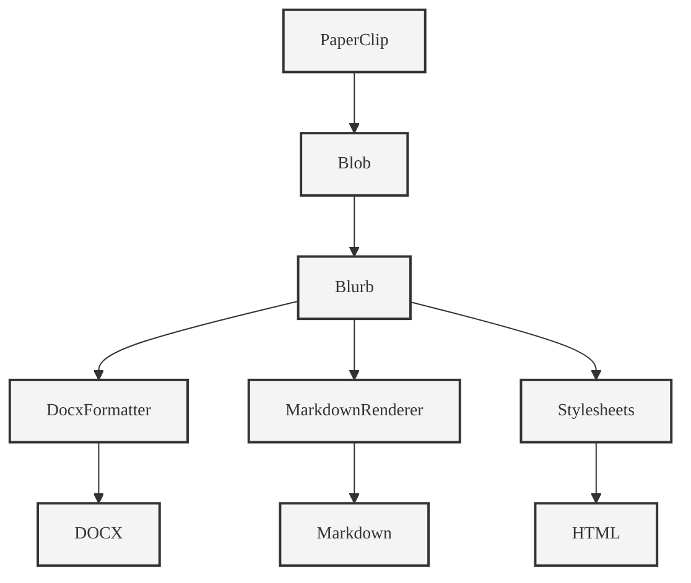

# Document Object Model Facet

## Overview

The Document Object Model Facet defines the structure for representing knowledge within PaperClip. It ensures a clear separation between content and presentation by organizing data into three key components: Blob, Blurb, and Channel.

## Components

1. **Blob**:
   - Represents the raw collection of text or data.
   - Serves as the foundational content layer.
   - Independent of any presentation or formatting.

2. **Blurb**:
   - Acts as the declarative presentation layer.
   - Defines how the Blob is displayed or formatted.
   - Relies on the Channel for specific display rules.
   - Examples:
     - **Docx Formatter**: Formats content for DOCX outputs.
     - **Stylesheets**: Applies CSS or other styling rules.
     - **Markdown Renderer**: Converts content into Markdown format.

3. **Channel**:
   - Represents the display medium (e.g., Markdown, DOCX, HTML).
   - Provides the rules and context for rendering the Blurb.
   - Examples:
     - **Markdown**: Open-source library `markdown-it`.
     - **DOCX**: Open-source library `docxtemplater`.
     - **HTML**: Open-source library `jsdom`.

## Features

- Supports blurb-based content representation.
- Enables content-presentation separation.
- Optimized for generative AI workflows.
- Extensible with plugins for additional features.

## Diagram

Below is a conceptual diagram illustrating the relationship between Blobs, Blurbs, and Channels in PaperClip, styled to resemble Keynote diagrams:

