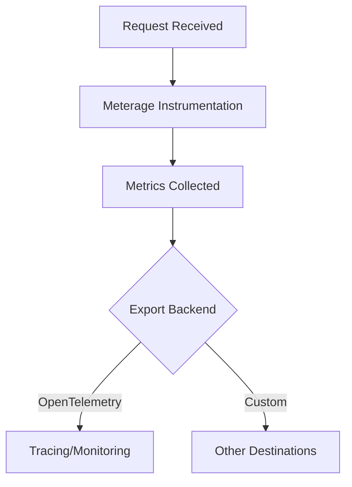

# Instrumentation Facet

## Overview

The Instrumentation Facet of PaperClip enables comprehensive observability by capturing and exporting metrics for each request and response. This facet is designed to help compute the work done per operation, track system health, and provide actionable insights for performance tuning and debugging.

## Features

1. **Request/Response Metrics**: Automatically records work units, latency, and throughput for every request and response.
2. **OpenTelemetry Integration**: Uses OpenTelemetry SDKs to instrument request handlers and export traces/metrics.
3. **Meterage Plugin**: Integrates with the custom OpenTelemetry plugin Meterage (from the rainfall-one/crucible repository) to automatically collect CPU, GPU, memory, and IO metrics for each request/response cycle.
4. **Custom Metrics**: Allows extension with domain-specific metrics as needed.
5. **Minimal Overhead**: Designed for high performance and low impact on request processing.

## Meterage: Custom OpenTelemetry Plugin

[Meterage](https://github.com/rainfall-one/crucible) is a custom OpenTelemetry plugin that instruments and exports detailed resource usage metrics:
- **CPU Usage**: Tracks CPU time per request.
- **GPU Usage**: Captures GPU utilization for workloads that use GPU resources.
- **Memory Usage**: Monitors memory consumption during request processing.
- **IO Usage**: Measures file system and network IO per request.

Meterage automatically hooks into the request lifecycle, so developers do not need to manually add instrumentation code for these metrics.

### Example Integration (SvelteKit/Node.js)

1. Install Meterage from the [crucible](https://github.com/rainfall-one/crucible) repository.
2. Register Meterage as an OpenTelemetry instrumentation plugin in your app's telemetry setup.
3. Metrics for CPU, GPU, memory, and IO will be automatically collected and exported with each request trace.

## Diagram

## References
- [OpenTelemetry](https://opentelemetry.io/)
- [Meterage Plugin (rainfall-one/crucible)](https://github.com/rainfall-one/crucible)
